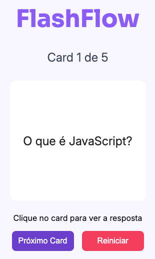

## 📚 Flashcards de Estudo  

  

### 📖 Sobre o Projeto  
Este projeto é uma aplicação web de **flashcards interativos** desenvolvida com **HTML, CSS e JavaScript**.  
O objetivo é facilitar os estudos através de perguntas e respostas rápidas: ao clicar em um card, a resposta é exibida de forma dinâmica.  

A aplicação foi publicada no **GitHub Pages** para fácil acesso e utilização.  

---

### 🚀 Funcionalidades  
- Exibição de **perguntas e respostas** em formato de flashcards.  
- Clique no card para revelar a resposta.  
- Navegação entre diferentes perguntas.  
- Design responsivo para uso em diferentes dispositivos.  

---

### 🛠️ Tecnologias Utilizadas  
- **HTML5** → Estrutura da aplicação  
- **CSS3** → Estilização e responsividade  
- **JavaScript** → Interatividade e lógica dos flashcards  

---

### 📂 Estrutura do Projeto  

📁 studycards

├── index.html

├── styles.css

├── scripts.js

└── assets

├── capa-flashcards.png

└── logo.png 

---

### 🌐 Acesse o Projeto  
👉 [Clique aqui para acessar no GitHub Pages](https://github.com/julio-fh/studycards) 

---

### 🤝 Contribuição  
Se desejar contribuir com melhorias, siga os passos:  
1. Faça um fork do repositório  
2. Crie uma branch para sua feature (`git checkout -b feature/nova-feature`)  
3. Commit suas alterações (`git commit -m 'Adiciona nova feature'`)  
4. Faça o push para a branch (`git push origin feature/nova-feature`)  
5. Abra um Pull Request  

---

### 📜 Licença  
Este projeto está sob a licença **MIT**.  

  

### 👨‍💻 Autor

Feito com ❤️ por Júlio Filho